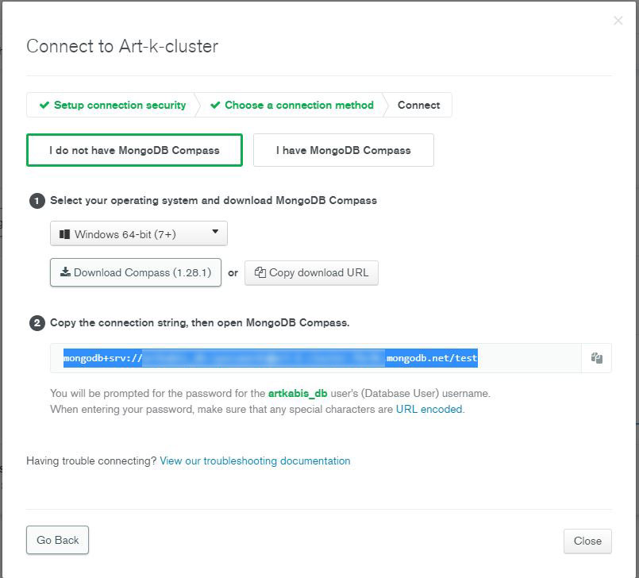
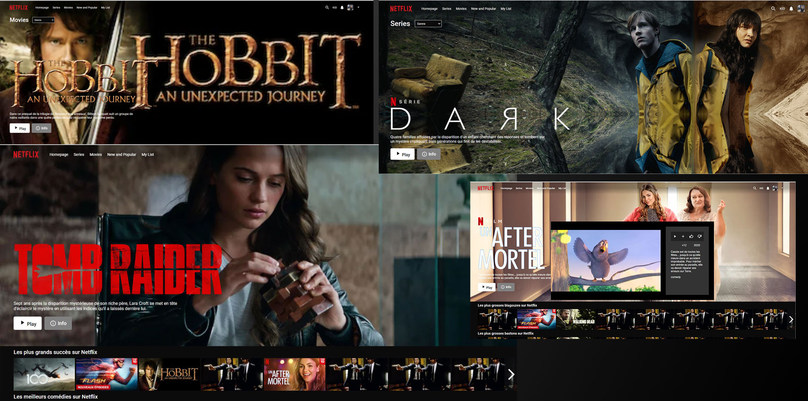

# 🚀 netflix-custom - Javascript full-stack 🚀
## MERN Stack
### React / Express / MongoDB / Axios

Start api (back-end) and client (font) : 
```bash
npm install
npm start
```


_____________________________

### API config :

* Create `.env` file inside `/api/` within the following data
  - MONGO_URL="mongodb+srv://..." `your mongodb atlas url`
  - TOKEN_SECRET=4f56ds454f545f454f545f4d5 `your random secret key`[ Generate web token to jwt.io ](https://jwt.io/)
  - REACT_APP_API_URL = "http://localhost:5000/api/" or "https:your-app.herokuapp.com/api/
  
  * Mongodb Atlas `url to database` 
_________________________
  
### Preview app in action :



### Demo : https://netflix-custom.herokuapp.com/
💻 Custom project to Artkabis, Sept 2021.

